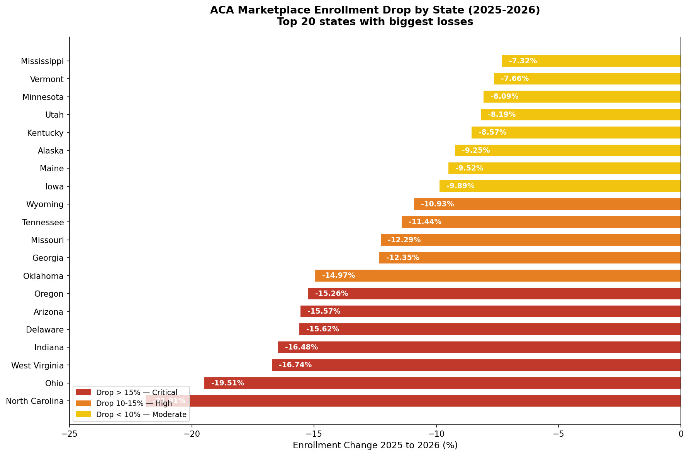
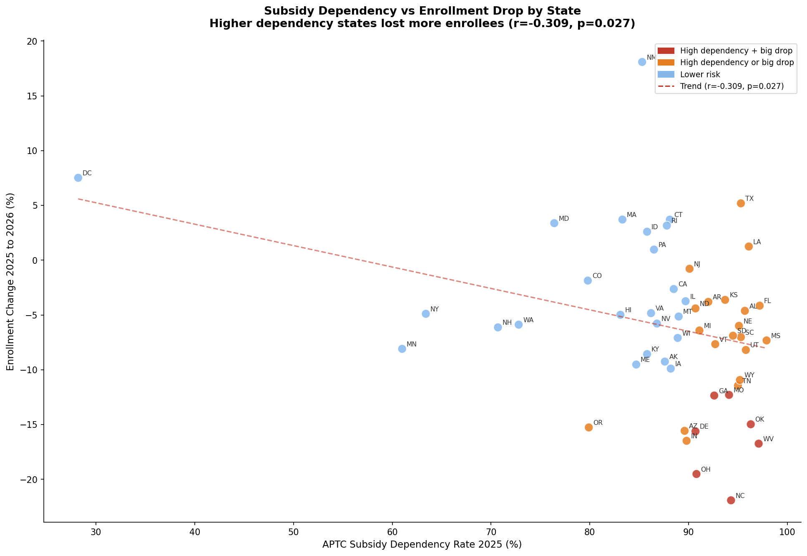
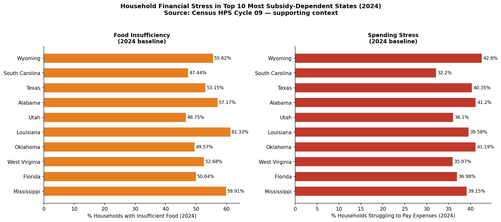

# Priced Out: Mapping the ACA Coverage Collapse Across U.S. States (2025-2026)



## Overview

ACA marketplace enrollment dropped 4.9% nationally in 2026, removing 1.19 million Americans from health coverage. But the national number hides what is actually happening at the state level. Some states lost more than 20% of their enrolled population in a single year. The people who stayed are choosing the cheapest possible plans. And the remaining enrollees are almost entirely dependent on government subsidies that could shrink with a single policy change.

This project analyzes CMS Open Enrollment Period data for 2025 and 2026 across all 51 states to identify where the collapse hit hardest, how enrollees are responding, and which states are most exposed to further losses.

---

## Live Dashboard

[View Interactive Tableau Dashboard](https://public.tableau.com/app/profile/samiksha.dhadve2402/viz/ACAenrollment_17811212776110/Dashboard1)

> For the best experience open this link in full screen view. Click any state on the map to filter all charts to that state.

---

## Key Findings

### Finding 1 -- Enrollment collapse was uneven across states

Nationally enrollment fell 4.9%, but the state-level picture tells a different story. North Carolina lost 21.9% of its enrolled population in one year -- 213,653 people. Ohio lost 19.5%. West Virginia lost 16.7%. These are not gradual declines. They are sharp single-year drops that leave significant gaps in coverage across entire states.

| State | 2025 Enrollment | 2026 Enrollment | Drop |
|-------|----------------|----------------|------|
| North Carolina | 975,110 | 761,457 | -21.9% |
| Ohio | 313,023 | 251,985 | -19.5% |
| West Virginia | 89,948 | 74,906 | -16.7% |
| Indiana | 219,264 | 183,116 | -16.5% |
| Delaware | 52,931 | 44,663 | -15.6% |

### Finding 2 -- People who stayed are downgrading to bare-minimum plans

This is the most original finding in the project. Enrollees are not leaving entirely -- many are staying enrolled but choosing bronze plans, which are the cheapest option with the highest out-of-pocket costs. Tennessee went from 35.9% bronze enrollment in 2025 to 56.1% in 2026 -- a 20.2 percentage point shift in one year. Arizona, Mississippi, and Ohio show similar patterns.

This is a signal of affordability pressure. People are keeping coverage on paper while stripping it down to the bare minimum they can afford.

Statistical confirmation: bronze shift correlates with enrollment drop at r = -0.467, p = 0.001. States that lost more enrollees also saw the biggest shift toward bronze plans among those who stayed.

### Finding 3 -- Remaining enrollees are one policy change away from losing coverage

97.9% of Mississippi's enrolled population only has coverage because the government pays most of their monthly premium through APTC subsidies. Florida is at 97.2%. Oklahoma at 96.3%. Across 12 states, 95% or more of enrollees receive subsidies.

These enrollees are paying as little as $50 to $67 per month instead of the full market rate of $500 to $900 per month. If federal subsidies are reduced or expire, those people face a choice between paying full price they cannot afford or dropping coverage entirely.

### Supporting Finding -- These states were already financially fragile in 2024

Using Census Household Pulse Survey data from 2024, the states with the highest subsidy dependency also showed the highest household financial stress before the coverage collapse began. Louisiana had 61.3% food insufficiency. Mississippi 59.9%. Alabama 57.2%. The correlation between food stress and subsidy dependency is r = 0.621, p = 0.000.

These households were not caught off guard by an unexpected crisis. They were already struggling before 2026, which makes the coverage loss significantly harder to absorb.

---

## Charts

### Enrollment Drop by State


### Bronze Plan Shift by State


### APTC Subsidy Dependency by State


### Subsidy Dependency vs Enrollment Drop


### Financial Stress in Most Vulnerable States


---

## Data Sources

| Dataset | Source | Year | Link |
|---------|--------|------|------|
| CMS Open Enrollment Period State-Level Public Use File | Centers for Medicare and Medicaid Services | 2025 | [CMS.gov](https://www.cms.gov/data-research/statistics-trends-reports/marketplace-products/2025-marketplace-open-enrollment-period-public-use-files) |
| CMS Open Enrollment Period State-Level Public Use File | Centers for Medicare and Medicaid Services | 2026 | [CMS.gov](https://www.cms.gov/data-research/statistics-trends-reports/marketplace-products/2026-marketplace-open-enrollment-period-public-use-files) |
| Household Pulse Survey Cycle 09 | U.S. Census Bureau | 2024 | [Census.gov](https://www.census.gov/data/tables/2024/demo/hhp/cycle09.html) |

All datasets are publicly available at no cost.

---

## Methodology

**Data cleaning:** CMS files required comma stripping from numeric columns and removal of 4 blank trailing rows in the 2026 file. Census xlsx files were parsed using Python's zipfile and xml libraries since each state occupies a separate sheet. HTOPS coded values of -99 were excluded from calculations as they represent questions not asked to certain respondents.

**Enrollment drop calculation:** Percentage change from 2025 to 2026 enrollment counts using state-level totals, excluding the national summary row.

**Bronze shift calculation:** Difference in bronze plan enrollment percentage between 2025 and 2026 for each state.

**APTC dependency rate:** APTC enrollees divided by total enrollees per state, expressed as a percentage.

**Correlations:** Pearson correlation coefficients calculated using scipy.stats. Two correlations were found non-significant and dropped from the analysis -- rural percentage vs enrollment drop (r = 0.037, p = 0.845) and premium increase vs enrollment drop (r = -0.104, p = 0.468). Only statistically significant relationships are reported as findings.

---

## Tools and Stack

| Tool | Purpose |
|------|---------|
| Python (Google Colab) | Data cleaning, analysis, chart generation |
| pandas, numpy, scipy | Data manipulation and statistical analysis |
| matplotlib | Static chart generation |
| Tableau Public | Interactive dashboard |
| GitHub | Project publishing |

---

## Repository Structure

```
aca-coverage-collapse-2025-2026/
│
├── data/
│   ├── 2025_OEP_StateLevel_Public_Use_File.csv
│   ├── 2026_OEP_StateLevel_Public_Use_File.csv
│   ├── food1_cycle09.xlsx
│   ├── spending1_cycle09.xlsx
│   └── aca_enrollment_master.csv
│
├── charts/
│   ├── chart1_enrollment_drop.png
│   ├── chart2_bronze_shift.png
│   ├── chart3_aptc_dependency.png
│   ├── chart4_scatter.png
│   └── chart5_financial_stress_context.png
│
├── aca_enrollment_analysis.ipynb
└── README.md
```

---

## Author

Samiksha Dhadve

[Tableau Public Profile](https://public.tableau.com/app/profile/samiksha.dhadve2402)
