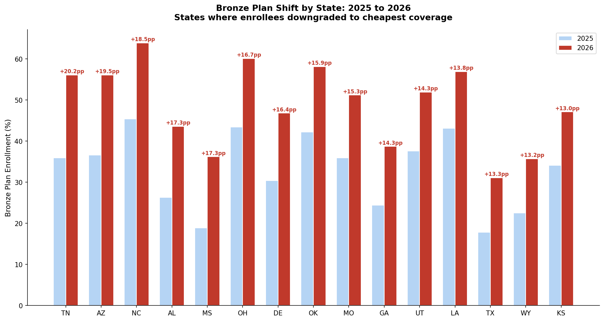
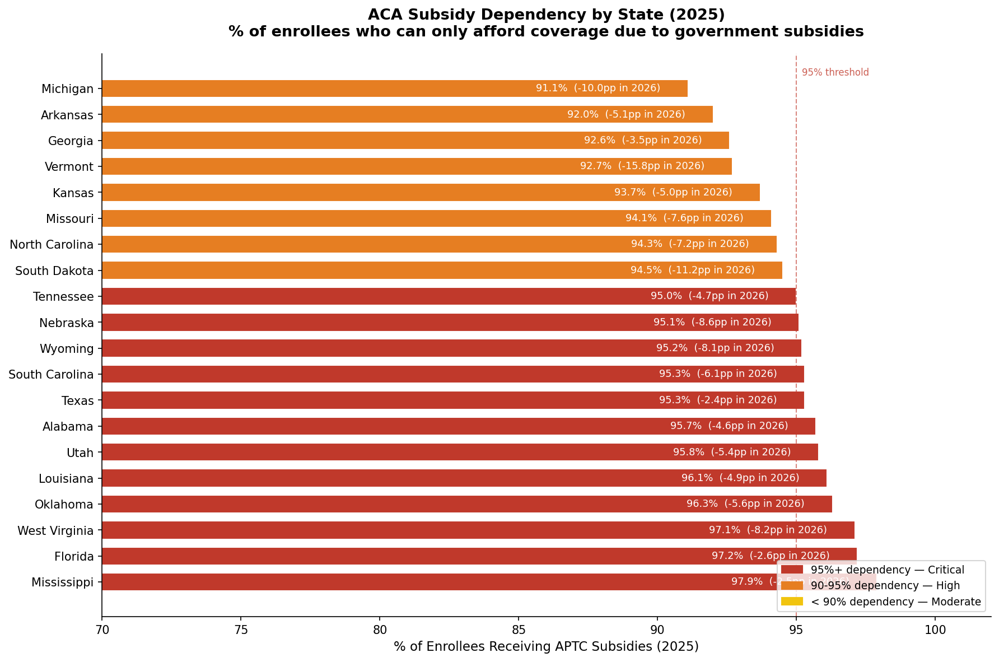

# Priced Out: Mapping the ACA Coverage Collapse Across U.S. States (2025-2026)


## Overview

1.19 million Americans lost ACA marketplace coverage in 2026. But the national number hides what is actually happening state by state. Some states lost more than 20% of their enrolled population in a single year. The people who stayed are choosing the cheapest possible plans. And the remaining enrollees are almost entirely dependent on government subsidies that could disappear with one policy change.

This project uses CMS Open Enrollment Period data for 2025 and 2026 across all 51 states to answer three questions: where did the collapse hit hardest, how are remaining enrollees coping, and which states face the greatest exposure to future losses.

**[View Interactive Tableau Dashboard](https://public.tableau.com/app/profile/samiksha.dhadve2402/viz/ACAenrollment_17811212776110/Dashboard1)**

> Open in full screen for the best experience. Click any state on the map to filter all charts to that state.

---

## Key Findings

### 1. The collapse was uneven

North Carolina lost 21.9% of its enrolled population in a single year. Ohio lost 19.5%. West Virginia 16.7%. These are not gradual declines. They are sharp single-year drops concentrated in specific states while others barely moved.

| State | 2025 Enrollment | 2026 Enrollment | Change |
|-------|----------------|----------------|--------|
| North Carolina | 975,110 | 761,457 | -21.9% |
| Ohio | 313,023 | 251,985 | -19.5% |
| West Virginia | 89,948 | 74,906 | -16.7% |
| Indiana | 219,264 | 183,116 | -16.5% |
| Delaware | 52,931 | 44,663 | -15.6% |

### 2. People who stayed are downgrading to bare-minimum plans

This is the most original finding in the project. Enrollees are not leaving entirely. Many are staying enrolled but switching to bronze plans, which carry the lowest premiums and the highest out-of-pocket costs. Tennessee went from 35.9% bronze enrollment in 2025 to 56.1% in 2026, a 20.2 percentage point shift in one year.

This pattern appears across Arizona, Mississippi, Ohio, and Oklahoma. It is a direct signal of affordability pressure. People are keeping coverage on paper while reducing it to the minimum they can afford.



Statistical confirmation: bronze shift correlates with enrollment drop at r = -0.467, p = 0.001.

### 3. Remaining enrollees are one policy change away from losing everything

97.9% of Mississippi enrollees only have coverage because the federal government pays most of their monthly premium. Florida is at 97.2%. Oklahoma at 96.3%. Across 12 states, 95% or more of enrollees receive subsidies. Without them, most of these people cannot afford coverage at market rates.



### Supporting Finding: These states were already financially fragile

Census Household Pulse Survey data from 2024 shows the states with the highest subsidy dependency also had the highest household financial stress before the collapse began. Louisiana had 61.3% food insufficiency. Mississippi 59.9%. The correlation between food stress and subsidy dependency is r = 0.621, p = 0.000. These households were already struggling before 2026.

---

## Data Sources

| Dataset | Source | Year |
|---------|--------|------|
| CMS OEP State-Level Public Use File | Centers for Medicare and Medicaid Services | 2025 |
| CMS OEP State-Level Public Use File | Centers for Medicare and Medicaid Services | 2026 |
| Household Pulse Survey Cycle 09 | U.S. Census Bureau | 2024 |

All datasets are publicly available at no cost.

---

## Methodology

Data cleaning involved stripping comma formatting from CMS numeric columns, removing 4 blank trailing rows in the 2026 file, and parsing Census xlsx files using Python's zipfile and xml libraries. Two correlations tested during EDA were found non-significant and dropped from the analysis: rural percentage vs enrollment drop (r = 0.037, p = 0.845) and premium increase vs enrollment drop (r = -0.104, p = 0.468). Only statistically confirmed relationships are reported as findings.

---

## Tools

Python, pandas, numpy, scipy, matplotlib, Tableau Public

---

## Repository Structure

```
aca-coverage-collapse-2025-2026/
├── data/
│   ├── 2025_OEP_StateLevel_Public_Use_File.csv
│   ├── 2026_OEP_StateLevel_Public_Use_File.csv
│   ├── food1_cycle09.xlsx
│   ├── spending1_cycle09.xlsx
│   └── aca_enrollment_master.csv
├── charts/
│   ├── aca_enrollment.png
│   ├── chart2_bronze_shift.png
│   └── chart3_aptc_dependency.png
├── aca_enrollment_analysis.ipynb
├── ACA_enrollment.twbx
└── README.md
```

---

*Author: Samiksha Dhadve*
